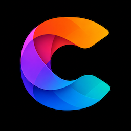

# 

---

# **Zodiac Innovation**

We create imaginative software for **iPhone**, **Android**, **Quest**, and beyond.  
Currently under development — new projects coming soon.

---

## **About**

**Zodiac Innovation** is an independent creative studio focused on building thoughtful, cross-platform apps.  
Founded by **Steve Sheets**, the company is dedicated to blending technology and artistry — delivering engaging experiences across mobile and immersive environments.

Our mission is to craft software that feels both intuitive and inspiring, whether on your phone, tablet, or in mixed reality.

---

## **Projects**

<table>
  <tr>
    <td width="112">
      
    </td>
    <td>
      <h3><a href="https://concordui.org">ConcordUI</a> (In Development)</h3>
      
A cross-platform Swift user-interface framework for creating applications on Apple and Android platforms.

    </td>
  </tr>
  <tr>
    <td width="112">
      
    </td>
    <td>
      <h3><a href="https://aethercircle.org">AetherCircle</a> (In Development)</h3>
      
A cross-platform framework for creating immersive applications for Apple Vision Pro and Meta Quest.

    </td>
  </tr>
</table>

---

## **Contact**

We’d love to hear from you.  
For inquiries, collaborations, or press, reach out at:  
📧 [info@zodiacinnovations.com](mailto:info@zodiacinnovations.com)

Follow us for updates:  
🔗 [LinkedIn](https://www.linkedin.com/company/zodiac-innovations)

---

© 2026 **Zodiac Innovation** — All Rights Reserved.  
[Privacy Statement](zodiac-innovations-privacy-statment.txt)
